# HELIOS : Réduction de l'impact écologique du service numérique d'un établissement de météorologie et de climatologie

## Choix du sujet
Nous revenons tous deux d'un semestre à l'étranger dans deux pays avec une météo très distincte. En Norvège la météo était particulièrement changeante et extrême par moments. Consulter la météo chaque jour est devenu une habitude, de même que la programmation journalière d'une notification récapitulative.

Aussi, nous nous sommes rendus compte que les habitudes de consommation des services de météo sont très différentes selon les régions du monde et leur climat. Dans les pays aux climats extrêmes, les habitants consultent plus régulièrement ces services pour prévenir les averses ou évènements climatiques (orages, ouragans, canicules, etc). Avec le dérèglement climatique, le nombre de ces évènements ne va qu'augmenter, ce qui fait que le nombre de potentiels utilisateurs ne va cesser de croître ([source: Courrier International](https://www.courrierinternational.com/article/technologie-face-au-rechauffement-climatique-les-applications-de-meteo-ont-le-vent-en-poupe)).

Météo France est le principal service de météo en France avec plus de 11 millions utilisateurs mensuels. C'est une référence en la matière, mais en remarquant le poids et la complexité du site, nous nous sommes attachés à concevoir une alternative avec un plus faible impact environnemental.

## Utilité sociale

A une époque où la situation climatique est de plus en plus incertaine et changeante, se renseigner sur la météo est primordial. De plus, regarder la météo du jour est une action quotidienne pour des millions d'utilisateurs et touche un large public. 
En plus d'informer sur la météo nationale, un tel service se doit de sensibiliser sur le réchauffement climatique et les catastrophes météorologiques qu'il cause. 

Météo France est un établissement public à caractère administratif ([source : Météo France](https://meteofrance.fr/etablissement)) chargé de missions en matière de sécurité météorologique des personnes et des biens. C'est un établissement qui remplit une mission d'intérêt général sous contrôle de l'Etat. Son service numérique est donc reconnu pour son utilité sociale.

## Effets de la numérisation

L'histoire des prévisions météoroligiques est relativement jeune et connait son avènement avec l'informatique et les satellites. Avant le Web c'est via la presse écrite et la radio que les prévisions étaient communiquées.
Désormais c'est via des applications mobiles principalement qu'elle est diffusée. On en comptait plus de 10 000 en 2023 et ce nombre ne va cesser d'augmenter. Cependant l'énorme majorité des services se basent uniquement sur l'un des cinq modèles ouverts suivants :

- Modèle européen ECMWF,
- Modèle américain GFS,
- Modèle français Arome (Méteo France),
- Modèle français Arpège (Méteo France),
- Modèle allemand Icon.

([source : Libération](https://www.liberation.fr/environnement/climat/face-a-meteo-france-des-concurrents-comme-sil-en-pleuvait-20240318_NKJTT4HMXJFERBRJYU2YHJVY3E/))

En 2022 le marché mondial des services de prévisions météorologiques pesait 2,20 milliards d'euros, et c'est un chiffre qui est attendu à la hausse pour les années à suivre ([source : Statista](https://www.statista.com/outlook/dmo/app/weather/worldwide)).

L'impact écologique de cette substitution du papier et de la radio par les applications mobiles est compliqué à établir. Néanmoins étant donné le changement des habitudes de consommation des utilisateurs et la multiplication des plateformes météo, il paraît pertinent de proposer une alternative plus sobre. Avec l'essor de l'IA, les GAFAM s'intéressent également à la prévision météorologique pour tenter de produire des modèles toujours plus précis. Ces petites améliorations de performance ne sont pas forcément nécessaires et ont un fort impact environnemental car elles nécessitent de nombreux serveurs et équipements numériques.

## Axes de travail

Notre premier axe de travail sera dirigé autour des publicités du site de météo france. En effet, le site contient de nombreuses images et vidéos provenant de publicité ainsi que des "pop-ups". Pour réduire l'impact écologique de la page, mais aussi réduire le temps de chargement, il nous paraît pertinent de les supprimer pour obtenir une page plus épurée. 
Dans un second temps, nous souhaitons également enlever la grande majorité des articles en fin de page. Sur la page d'accueil du site, la seconde partie est uniquement constituée d'articles avec une image ou vidéo pour le présenter. Toujours dans la même optique, nous souhaitons rendre la page plus pertinente et moins énergivore en ne laissant qu'un article. De ce fait, l'utilisateur aura plus de chances également de s'intéresser s'il n'est pas submergé par la quantité. 
Toujours pour les mêmes raisons, nous allons remplacer la carte de france qui est l'élément central de la page. Il sera possible par exemple de la remplacer par un tableau des températures et conditions météorologiques tout au long de la journée.
Enfin, l'application se doit également d'être accessible et pertinente pour le plus grand nombre. Ainsi, nous ajouterons une partie professionnelle, notamment avec la météo agricole pour les utilisateurs qui auront besoin d'informations complémentaires et plus précises pour centraliser les informations dans un même endroit.

## Scénario 1 : Consulter la météo
1. L'utilisateur de météo en ligne se rend sur la page d'accueil grâce à un favori (donc sans passer par un moteur de recherche). Il cherche l'onglet météo de sa région.
2. Il choisit de voir la météo de sa région.
3. Il consulte la météo du lendemain et des jours prochains.

## Scénario 2 : Consulter des articles
1. L'utilisateur de météo en ligne se rend sur la page d'accueil grâce à un favori (donc sans passer par un moteur de recherche). Il consulte les titres.
2. Il choisit un des articles et le lit en entier.
3. Il choisit un autre article à consulter parmi ceux présents en bas.
4. Il le lit jusqu'au bout

## Impact de l'exécution des scénarios auprès de différents services concurrents

L'EcoIndex d'une page (de A à G) est calculé (sources : [EcoIndex](https://www.ecoindex.fr/comment-ca-marche/), [Octo](https://blog.octo.com/sous-le-capot-de-la-mesure-ecoindex), [GreenIT](https://github.com/cnumr/GreenIT-Analysis/blob/acc0334c712ba68939466c42af1514b5f448e19f/script/ecoIndex.js#L19-L44)) en fonction du positionnement de cette page parmi les pages mondiales concernant :

- le nombre de requêtes lancées,
- le poids des téléchargements,
- le nombre d'éléments du document.

Nous avons choisi de comparer l'impact des scénarios sur les services de quotidiens nationaux de diverses sensibilités politiques, économiques et environementales :

- Météo France,
- Yr,
- Météo Agricole.

Les résultats sont les suivants (attention, d'une journée à l'autre, on peut observer une certaine variabilité) :

- Scénario "[Consulter la météo de ma région](https://htmlpreview.github.io/?https://raw.githubusercontent.com/UTT-GL03/helios/main/benchmark/consulterMeteo/results.html)",
- Scénario "[Lire des articles parmi les articles de la page d'accueil](https://htmlpreview.github.io/?https://raw.githubusercontent.com/UTT-GL03/helios/main/benchmark/scenarioArticle/benchmark_.html)".

Les résultats de performance sont assez différents entre Météo France, Yr et la Météo Agricole. Météo France et la Météo Agricole ont beaucoup de pubs et de cookies qui alourdissent la page et augmente le réseau nécessaire.

On peut aussi noter le nombre de requêtes nécessaires. Par exemple, pour charger la page d'accueil Meteo France il faut 75 requêtes HTTP. Cela confirme bien notre volonté de réduction du nombre d'articles et des images associées.
À noter que les différents résultats qu'ils soient la taille du DOM ou encore la taille de la page sont directement en corrélation avec les axes d'améliorations que nous avions envisagés. En effet, Meteofrance qui possède la carte de la France, les articles, et des vidéos possède le score le moins bon. Les deux autres sites testés respectent la même logique : moins il y a de features interactives et gourmandes en ressources,  meilleur est le score d'ecoIndex.

## Maquette de l'interface et échantillon de données

Au vu des différents services comparés, des exigences environnementales exprimées plus haut et des scénarios retenus, nous avons défini pour notre prototype une maquette de l'interface et un échantillon de données réalistes.

L'interface retenue est composée de deux types de "pages Web" :

- celle d'accueil, contenant la météo du jour des principales villes françaises,
- celle qui donne plus d'informations sur la météo d'une zone donnée ("interface pro").

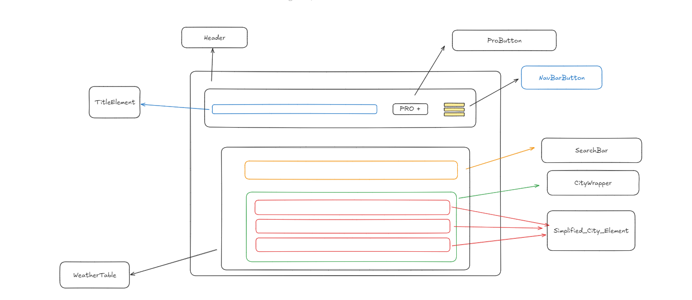
__Fig.1__: Maquette de l'interface d'accueil du prototype

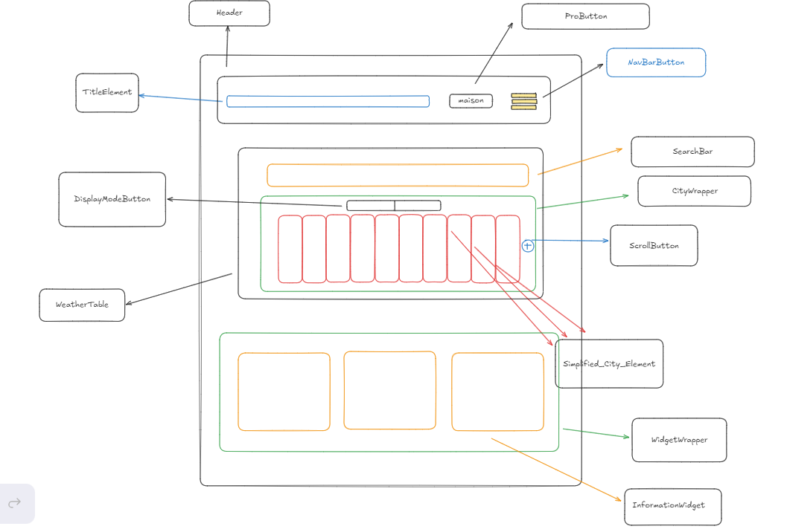
__Fig.2__: Maquette de l'interface pro du prototype

Pour des raisons de respect des droits d'auteurs, nous utilisons des données générées (avec [`dummy-json`](https://dummyjson.com)).
Bien que fictives, ces données correspondent à la structure des services concurrents : 3 villes comportant la météo pour chacun (température, vent, météo) sur 7 jours (voir [modèle de données](./frontend/sample_data.hbs)). 

## Prototype n°1 : Fonctionnalités pour le scénario prioritaire avec données statiques

Pour cette première version du prototype :

- l'échantillon de données est encore chargé dans le code de manière statique,
- les fonctionnalités implémentées ne sont que celles nécessaires pour suivre le scénario prioritaire ("Consulter la météo").

Ce scénario nécessite de pouvoir naviguer sur la page principale qui contient la météo du jour. On se sert ensuite de la barre de recherche pour trouver la météo de la ville qui nous intéresse.

### Page principale

Nous avons donc développé la page d'accueil pour qu'elle affiche un échantillon de données météo sous la forme d'un tableau, comme prévu par la maquette. Elle affiche la météo du jour pour 3 villes si aucune recherche n'est faite (cf. Fig. 3) et affiche la météo de la semaine si l'utilisateur recherche une ville en particulier (cf. Fig. 4)

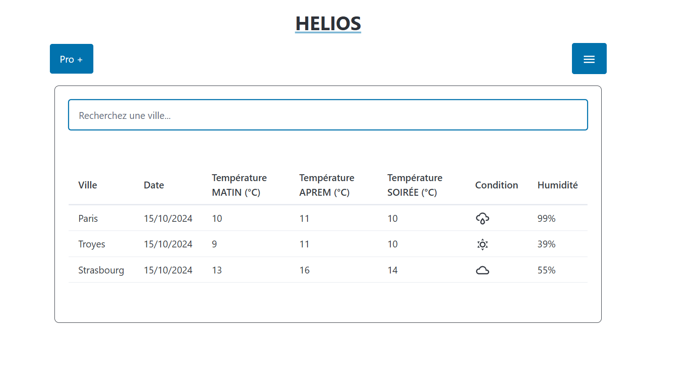
__Fig.3__: Prototype de la page principal 

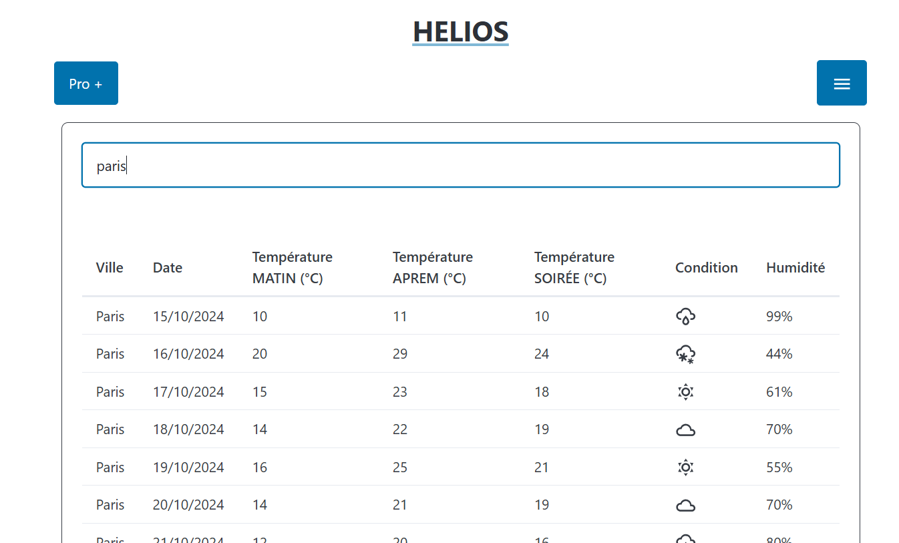
__Fig.4__: Prototype de la page principal avec une recherche

Pour l'instant, nous avons choisi le framework de mise en page minimaliste (PicoCSS). Dans la suite du projet, nous verrons si l'impact environnemental du passage à un framework de mise en page plus puissant (comme Bootstrap ou Tailwind) est acceptable.

Nous avons choisi une librairie qui permet l'import d'icones pour afficher de manière plus ludique la météo. Par la suite, nous étudierons l'impact de l'utilisation d'une librairie par rapport à l'import des fichiers .svg dans le projet.

Nous avons décidé, contrairement à l'ensemble des services concurrents, de ne pas surcharger la page d'informations, d'articles ou encore d'une carte interactive qui nécessite beaucoup de ressource. 
Si de telles fonctionnalités devaient être introduites, il faudrait mettre en balance leurs utilités et leurs impacts a priori important.

Dans l'état actuel du prototype, il est possible d'avoir une première idée de l'impact environnemental du frontend. Bien entendu, il manque encore le chargement dynamique des données, mais nous pouvons déjà évaluer l'impact de l'affichage des données et du framework (au sens large : React, PicoCSS, DayJS). Cette évaluation de l'impact (cf. Tab.1) est déjà encourageante en mode "développement" mais encore plus en mode "pré-production". Nous mesurons ici l'effet positif de l'adoption d'outils de développement Web intégrant la ["minification"](https://fr.wikipedia.org/wiki/Minification) (cf. *Wikipédia*) du code et la concaténation du code d'une part et des feuilles de style d'autre part.

|   | EcoIndex| GES (gCO2e) | Taille du DOM | Requêtes | Taille de la page (ko)
|---|--------:|------------:|--------------:|---------:|---------------------:
| Mode "développement"  | 76 B🟢 |  1,4 | 64 | 24 | 4609
| Mode "pré-production" | 93 A🟢 | 1,14 | 61 | 4 | 76 

__Tab.1__: Évaluation de l'impact du prototype de la page d'accueil.

Avec l'ajout de ce modèle de page et la mise en place de la navigation entre les deux modèles, il devient possible d'exécuter le scénario prioritaire complet et de mesurer son impact.

|   | EcoIndex| GES (gCO2e) | Taille du DOM | Requêtes | Taille de la page (ko)
|---|--------:|------------:|--------------:|---------:|---------------------:
| 1. Consulter la météo des villes de l'accueil 					   | 93 A🟢 |  1,14 | 61 | 4 | 76
| 2. rechercher  une ville			   | 91 A🟢 | 1,77 | 97 | 4 | 102
| 3. Revenir à l'accueil | 91 A🟢 | 1,77 | 97 | 4 | 102

__Tab.2__: Évaluation de l'impact du scénario "rechercher la météo d'une ville" dans le prototype n°1.

## Prototype n°2 : Fonctionnalités pour le scénario prioritaire avec données statiques chargées de manière dynamique

Pour cette deuxième version du prototype, les données (toujours statiques) sont désormais chargées par le frontend à travers le réseau immédiatement après un premier affichage à vide. Ce comportement, plus réaliste, n'a pour effet qu'une requête supplémentaire par page affichée.

Concernant l'évaluation de l'impact environemental du scénario, par rapport au tableau précédent (cf. Tab.2), à l'exception du nombre de requêtes qui est incrémenté de 1, les résultats sont strictement identiques.
D'ailleurs, à partir de cette version, et à moins de changements profonds, l'EcoIndex ne devrait plus évoluer de manière significative.
Nous utiliserons désormais un autre logiciel, *GreenFrame*, qui évalue non pas l'impact "environné" de la consultation (incorporant une participation au cycle de vie du terminal) mais celui de la consultation proprement dite (cf. Tab.3) et de manière beaucoup plus fiable à partir des statistiques d'utilisation des ressources physiques (CPU, mémoire, réseau, disque).

| | Impact de la consultation de la météo
|--------------|----:
| Meteo France | 302         
| Meteo Blue   | 183
| Meteo Agricole   | 80
| Yr           | 41          
| __HELIOS__ | __31__

__Tab.3__ : Impact en mg CO2e de la consultation proprement dite des pages des services existants et de notre prototype.

Pour les services existants, sur le graphique présentant l'utilisation dans le temps des ressources (cf. Fig.4), on constate d'autres pics que le pic initial, probablement associés au chargement et à l'affichage de contenus multimédias et de publicités, ou causés par des techniques de pistage sur le Web.

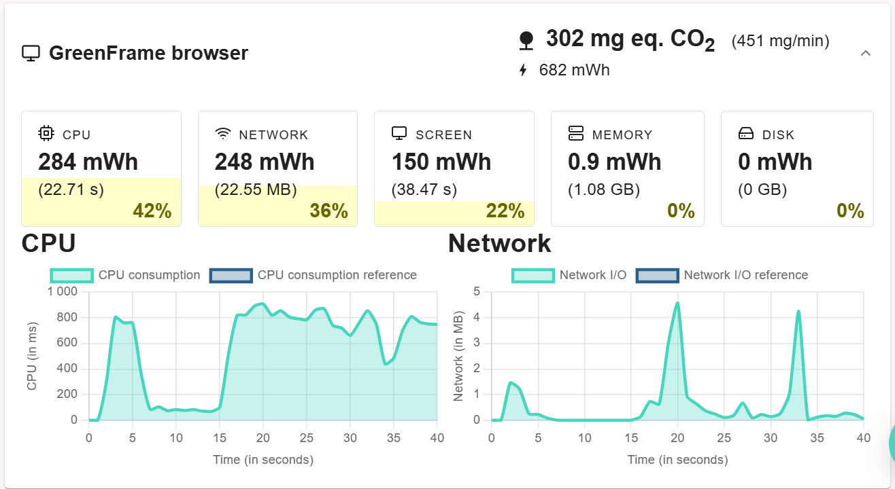
__Fig.5__: Consommation de ressources lors de la consultation de la page météo *météo france*.

Pour notre prototype, au contraire, le graphique (cf. Fig.5) présente un unique pic significatif de consommation de CPU et de réseau.
Notons par ailleurs que le pic de CPU est 40 fois plus faible que celui de la figure précédente.
Par ailleurs, nous remarquons que cette consommation ne compte que pour 3% de la consommation totale, le reste étant consommé par l'écran durant la durée de la mesure.

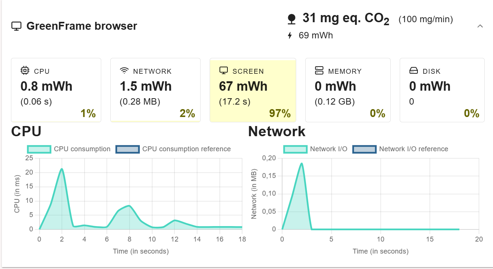
__Fig.6__ : Consommation de ressources par le navigateur lors de la consultation de la météo dans notre prototype.

## Prototype n°3 : Fonctionnalités pour le scénario prioritaire avec données stockées dans une base de données

Pour la troisième version du prototype, les données sont désormais stockées dans un système de base de données interrogeable à travers une API Web (*CouchDB*).
L'intérêt d'une source de données dynamique est d'une part, à terme, de pouvoir ajouter ou modifier la météo plus facilement, et d'autre part de déporter sur le serveur le filtrage des données pertinentes.

Sur ce deuxième enjeu, on observe  dans les mesures (cf. Fig.7) que la charge du réseau entre les deux prototypes concernant la consultation de la météo est sensiblement la même. Ceci est dû à la simplicité de notre application qui ne contient qu'une page à charger. Néanmoins, en supposant que notre application contiendra à terme plusieurs pages et d'autres lots de données, on peut s'attendre à une baisse de la charge du réseau pour l'aff

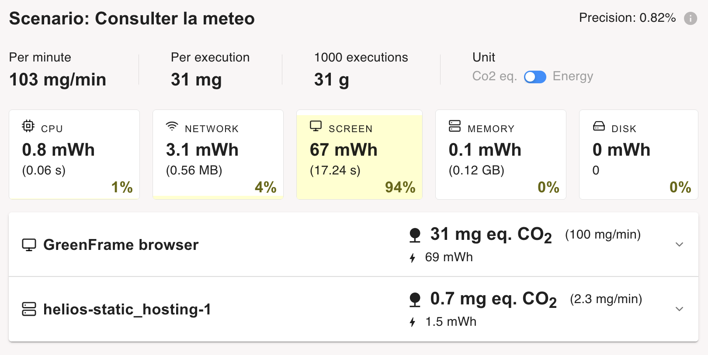
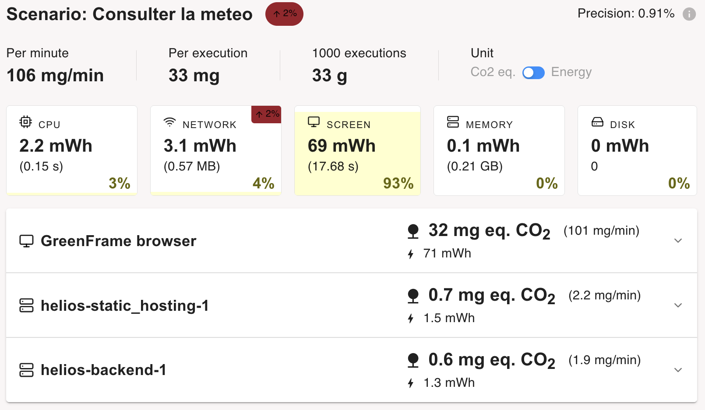
__Fig.7__ : Comparaison de l'impact de la consultation de la page de la météo entre les prototypes 2 (en haut) et (3 en bas).

De plus, on peut constater une utilisation du CPU par la base de données, utilisation qui semble par ailleurs continue et plus important qu'auparavant. (cf. Fig.8).

__Fig.8__ : Profil dans le temps de l'impact de la base de données lors de la consultation de la météo.

De ces différentes mesures, nous pouvons retenir que l'effet de l'introduction d'une base de données, quoique négligeable, est, pour l'instant, plutôt défavorable d'un point de vue écologique.
Le bilan de ce changement devrait cependant rapidement s'inverser avec l'augmentation de la quantité de données gérées.

## Prototype n°4 : Fonctionnalités pour le scénario prioritaire avec filtrage des données

### Passage à l'échelle

Dans le cas qui nous occupe de la presse quotidienne et dans le cadre des fonctionnalités envisagées (consultation d'articles), l'augmentation de la quantité des données à traiter ne viendra ni de l'augmentation du nombre de journalistes ni même de celle  des lecteurs.
Par contre, il est d'usage sur les applications de presse d'avoir accès aux archives du journal,
le but étant d'éclairer l'actualité à la lumière du passé plus ou moins proche.
Cette exigence fonctionnelle bien que coûteuse du point de vue environnemental nous semble contribuer grandement à l'utilité sociale de la plateforme.
Par conséquent nous adopterons également ce choix de conception.

L'augmentation du volume d'articles est linéaire : à raison de 25 nouveaux articles par jour, la base de données sera de 3000 articles au bout de 4 mois (et ainsi de suite).

### Évolution de l'impact environnemental avant correction

La figure 9 illustre l'impact du passage à l'échelle de 20 à 2000 éléments de météo (correspondant à la météo de 133 villes pendant 2 semaines 
 de manière quotidienne).
On observe, sur le *backend*, une multiplication par 16 de l'impact du processeur, et  concernant l'impact du réseau, une multiplication par 33 pour le *frontend* et une net augmentation non quantifiable (de 0 à 5 mWh) pour le *backend*.

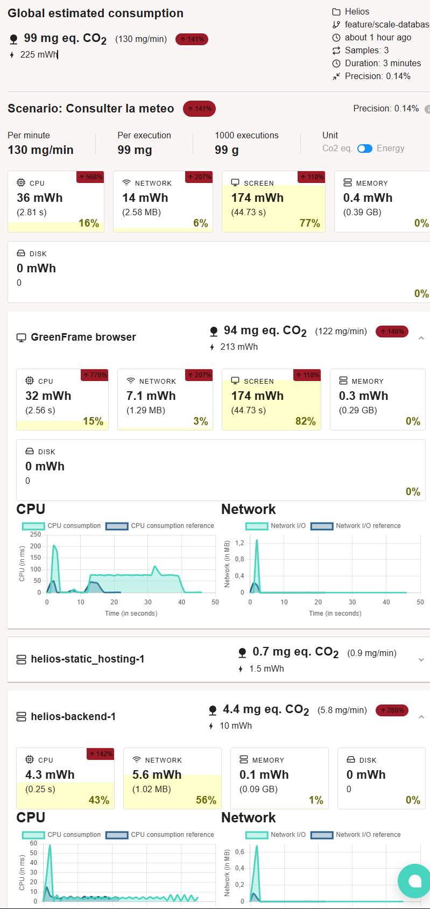
__Fig.9__ : Évolution de l'impact de la consultation de la météo en passant de 20 éléments à 2000 (soit 4 mois d'historique).

Dans un site de météo, une approche similaire à celle de la presse numérique peut être adoptée pour la gestion des données météorologiques. Au lieu de charger toutes les prévisions météo de l'année ou d'une longue période au départ, ce qui pourrait entraîner une surcharge de données et une expérience utilisateur moins fluide, nous pouvons opter pour une approche plus progressive.

Voici l'idée :

Prise en compte du passage à l'échelle dans l'application météo
Au lieu de charger l'intégralité des prévisions météo pour toutes les villes sur une longue période dès l'ouverture de l'application, nous adopterons une méthode de chargement progressif des données. Concrètement, dès l'ouverture de l'application nous commencerons par charger un nombre réduit de prévisions 10 éléments de météo.

Stratégies de chargement des données :
Affichage initial (3 jours) :

Lorsque l'utilisateur accède à la page principale de l'application ou à une page de détails pour une ville donnée, seuls les prévisions météorologiques de 10 dates et/ou villes seront chargées. Ces données peuvent être issues d'une API de météo.
Cela permet d'afficher rapidement des informations sans nécessiter un gros téléchargement initial.
Chargement en fonction de la recherche de l'utilisateur :

Si l'utilisateur souhaite consulter des prévisions précise par exemple une ville particulière, l'application chargera  les prévisions supplémentaires de la ville concerné en fonction de la recherche de l'utilisateur. Lorsqu'il fait défiler la page ou clique sur un bouton pour voir plus de prévisions, l'application enverra une requête à l'API pour récupérer les prévisions des jours suivants.

### Évolution de l'impact environnemental après correction

La stratégie choisie a eu l'effet escompté : les mesures d'impact (cf. Fig. 10) montrent que son implémentation a permis de contrecarrer l'augmentation de l'impact environnemental causée par le passage de 30 à 3000 articles.

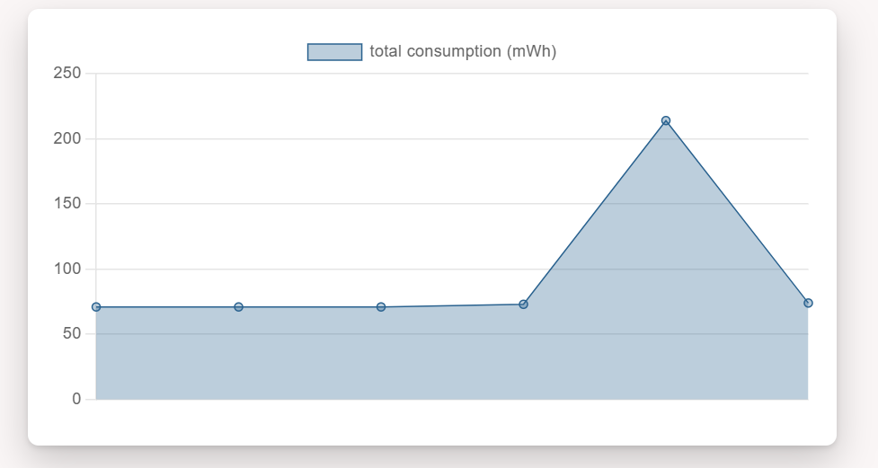
__Fig.10__ : Évolution de l'impact de l'application avec l'augmentation de la quantité de données puis sa prise en compte.

On peut voir un retour à l'impact d'avant l'augmentation de la quantité des données traitées, = notamment sur le réseau entre le *backend* et le *frontend* (cf. Fig. 11).
Cette amélioration s'explique par le fait que la technique utilisée pour filtrer les articles a également permis de choisir les attributs réellement nécessaires (et donc de ne plus transférer le contenu des articles pour cette page des titres).

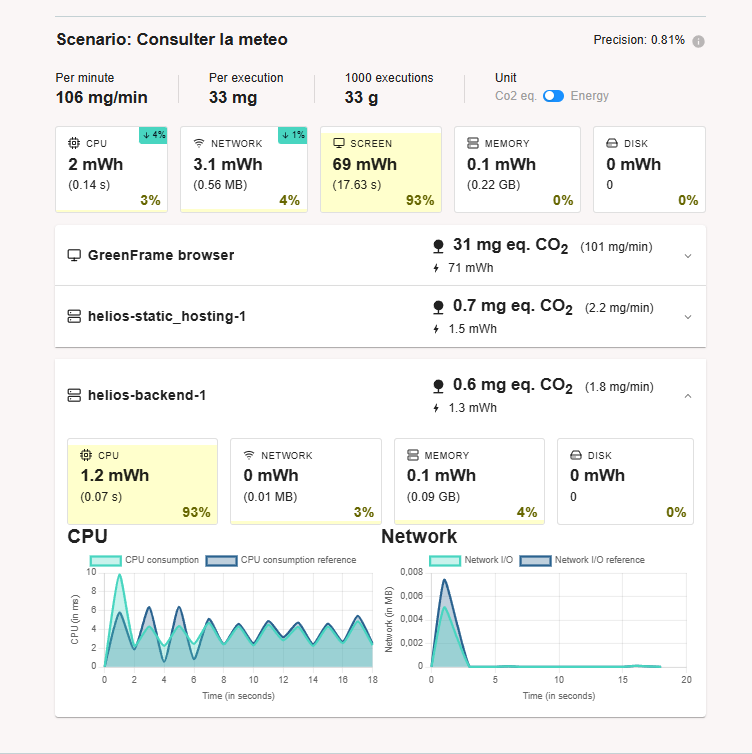
__Fig.11__ : Comparaison de l'impact de la page des titres optimisée avec 2000 éléments et non-optimisée avec 20 éléments.